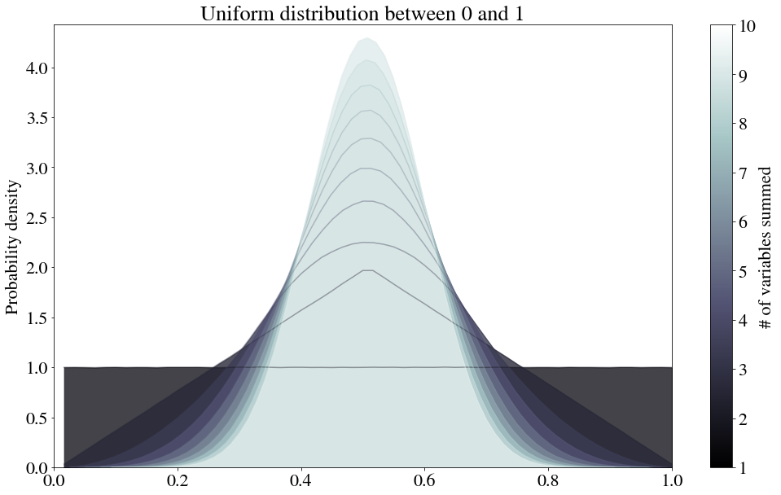
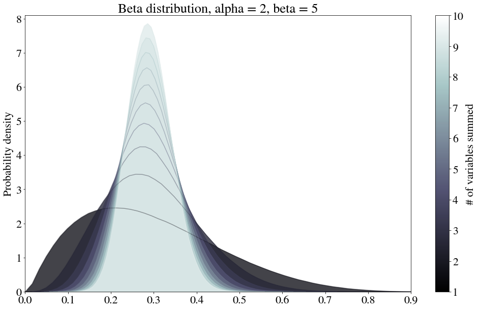
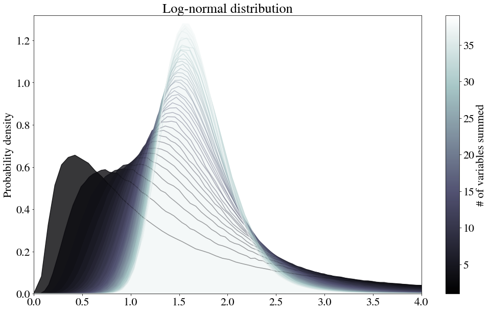
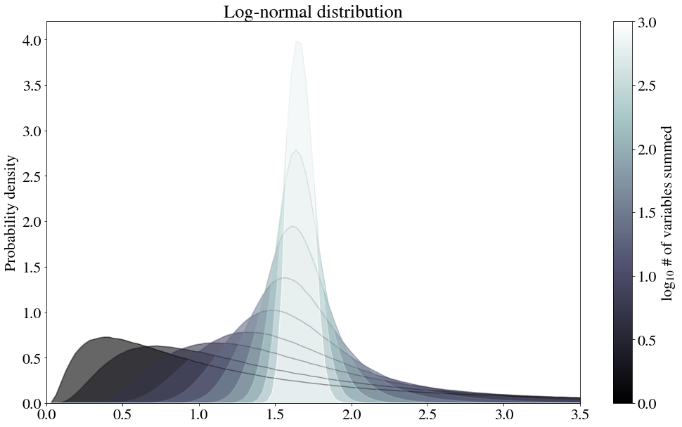
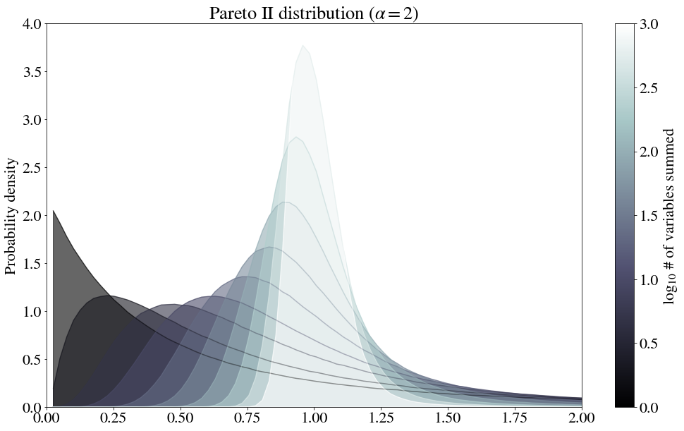
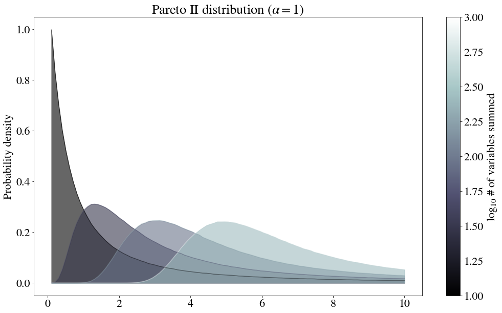

The central limit theorem states that the distributions of sums of random variables approach normality, so long as:

1. The sampling is independent.
1. The second moment of the parent distribution exists.

The first of these conditions simply requires that there is no correlation between the summed variables. The second requires these variables to be drawn from a distribution that has a finite variance.

Because I have always had poor intuition for this theorem, I thought I'd spend some time making some visualizations of how sums of variables from different distributions converge to normality with increasing numbers of elements summed.

Note that I divide the resulting sum by the number of elements summed. If the central limit holds, then, the resulting normal distribution should be centered around the average value of the parent distribution.

## Uniform distribution

Below is the convergence of uniform distribution between 0 and 1. Note that an unbounded uniform distribution is a trivial example of a distribution with an infinite variance for which no convergence would occur.

## Beta distribution
The beta distribution is a normalized version of:

$$P(x) \sim x^{\alpha-1} (1-x)^{\beta -1}$$

Because it's only defined between 0 and 1, it certainly satisfies the condition that the second moment is finite.

## Log-normal distribution
Curiously, this theorem also works for the log-normal distribution:

$$P(x) \sim \frac{1}{x} e^{- (\ln x - \mu)^2 / 2 \sigma^2}$$

It takes a bit longer for the convergence to occur, so let's try log-spacing the number of samples to average.

Because there are so many distributions that are log-normal, the central limit applied here has some strong practical ramifications that I had not before considered. For example, if price distributions tend to be log-normal, then a revenue distribution for which multiple orders are placed could perhaps be more accurately described as one of these in-between shapes.

Or, considering [prices tend to be between power law or log normal](https://link.springer.com/content/pdf/10.1007%2Fs00191-009-0142-z.pdf), could log normality here somehow be a step on the way to normalcy, from the summing of random independent variables that are power-law distributed?

## Pareto distributions
The so-called "Pareto distribution" is simply a power law distribution $P(x) \sim 1/x^a$. To avoid the singularity at $x=0$, this is often shifted over, or only defined starting at $x=1$ (or a different value, depending on the scaling).

`numpy.random.pareto` is used here. The formula appears to be:

$$P(x) \sim \frac{1}{(1+x)^{\alpha+1}}$$

For $\alpha = 2$, for which the variance is finite, the normal distribution appears.

However, for $\alpha =1$, for which the variance is infinite, the curves flatten and widen. Note these are normalized, so the decreasing height of the peak indicates spreading.

While this empirical test does seem to indicate that no convergence to a normal distribution occurs, as expected, I still wonder if this converges to something else? It's starting to look awfully log-normal.

## Final notes
I still have some lingering thoughts. First, let $N$ be the number of variables summed. If the distribution eventually approaches a true normal distribution, with enough summing and sampling, values far from the mean must be observed. Therefore, for any bounded distribution, I suspect that the **variance must approach $0$ as $N\to \infty$**.

A couple remaining open questions:

* **How does the peak of the pdf change with $N$?**   This peak increases in height as the distribution narrows as mentioned above, but for the log-normal case it decreases before it increases.
* **Why does the power law appear to converge slower than the other distributions?**   There appears to be some relation to relaxation methods (how boundary conditions add in a persistent effect after each iteration), but to really understand this, I need to do the math.

