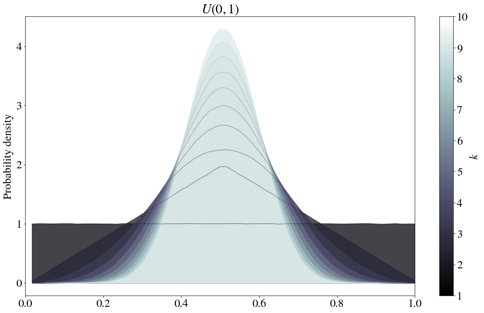
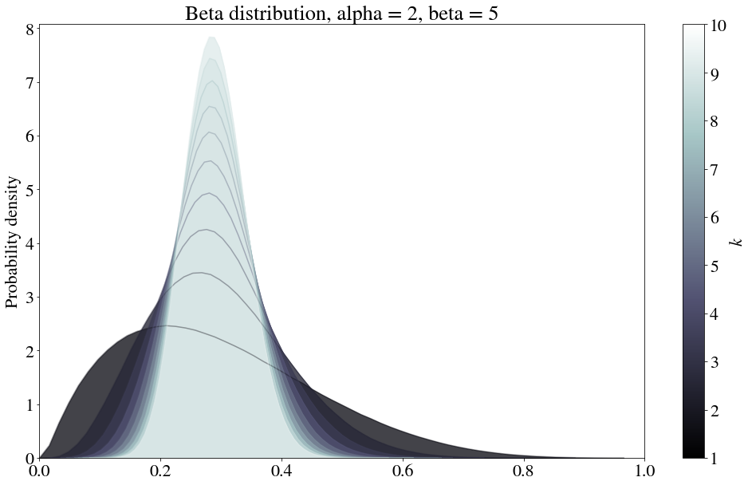
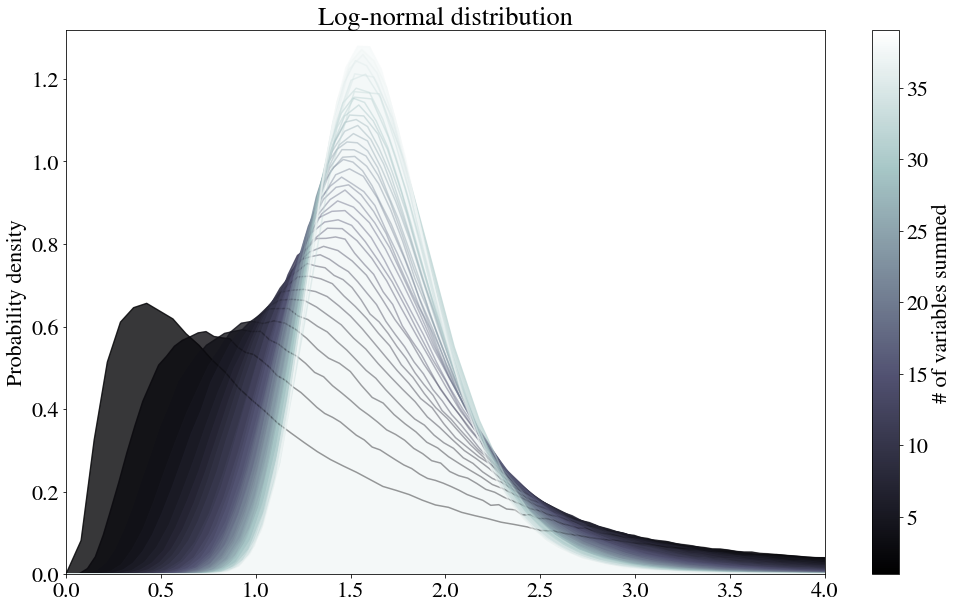
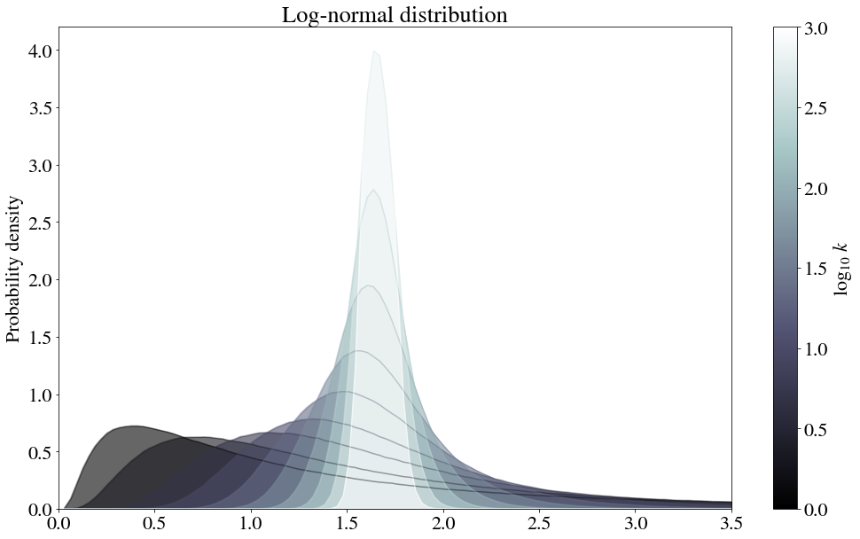
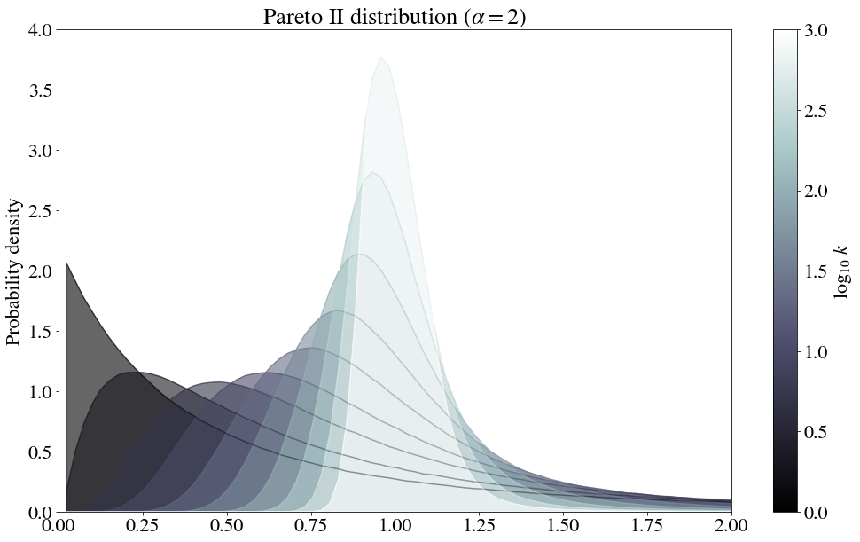
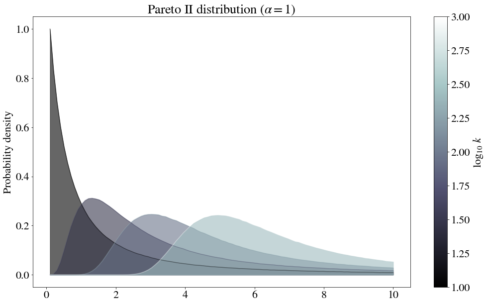

I am no statistician! But the central limit theorem has interested me recently, so please humor me as I share some roughly sketched ideas.  

The central limit theorem states that, given a parent distribution of mean $\mu$ and variance $\sigma^2$, if you independently draw $k$ samples from this parent distribution, average them to get one value, then repeat this process over and over, the resulting distribution formed by these values will approach a normal distribution of mean $\mu$ and variance $\sigma^2/k$ as $k \to \infty$.

Because I have always had poor intuition for this theorem, below I'll discuss (with very simple examples) how this convergence to normality occurs for different parent distributions, along with some illustrations.

## Uniform distribution
Consider a uniform distribution defined between 0 and 1 (note that an unbounded uniform distribution is a trivial example of a distribution with an infinite variance for which no convergence would occur).

The most curious feature is the kinked line that occurs when $k=2$. The functional form of this kinked line can be found theoretically. In particular, we need to obtain the total probability that two values $x_1$ and $x_2$ sum to a particular value $u$ (for now, this is defined between $0$ and $2$ -- we will divide by $2$ later to turn this sum into an average). This can be written as follows:

$$P(u = x + y) = \int_{-\infty}^{\infty} P(x) P(u - x) \ dx$$

(note this is a convolution -- for a fantastic, more thorough explanation of the above equation, see [Understanding Convolutions](http://colah.github.io/posts/2014-07-Understanding-Convolutions/) by Christopher Olah). $P(x) = 1$, so the integrals should be quite simple. The only trick here is to solve for the piecewise behavior... $P(u - x)$ is only $1$ where $0 \leq u - x \leq 1$, or in other words, where $ -1 +u \leq x \leq u $, and $P(x)$ is only $1$ when $0 \leq x \leq 1$. Therefore, between $0 \leq u \leq 1$, we have

$$P(u) = \int_{0}^{u} dx = u$$ 

And for $u>1$, we have

$$P(u) = \int_{-1+u}^{1} dx = 2 - u$$

We can define $G(u)$, the probability density function for the average of two values $x_1$ and $x_2$, by moving the threshold to $u=1/2$ and doubling the density, as follows:

$$G(u) = 
\begin{cases}
4 u & 0 \leq u \leq 0.5 \\
4 - 4u & 0.5 \leq u \leq 1 \\
0 & \text{otherwise}
\end{cases}
$$

... consistent with our figure!

## Beta distribution
The beta distribution is a normalized version of:

$$P(x) \sim x^{\alpha-1} (1-x)^{\beta -1}$$

Because it's only defined between 0 and 1, it certainly satisfies the condition that the second moment is finite.

## Log-normal distribution
Curiously, this theorem also works for the log-normal distribution:

$$P(x) \sim \frac{1}{x} e^{- (\ln x - \mu)^2 / 2 \sigma^2}$$

It takes a bit longer for the convergence to occur, so let's try log-spacing the number of samples to average.

Because there are so many distributions that are log-normal, the central limit applied here has some strong practical ramifications. For example, if price distributions tend to be log-normal, then a revenue distribution for which multiple orders are placed could perhaps be more accurately described as one of these in-between shapes. Or, at a coarser scale, this could mean that the amount of money spent by a person each year is normally distributed.

Or, considering [prices tend to be between power law or log normal](https://link.springer.com/content/pdf/10.1007%2Fs00191-009-0142-z.pdf), if log normality is observed, could it somehow be a step on the way to normalcy, from the summing of random independent variables that are power-law distributed? Let's move onto power-law distributions to find out!

## Pareto distributions
The "Pareto distribution" is a power law distribution $P(x) \sim 1/x^a$. To avoid the singularity at $x=0$, this is often shifted over, or only defined starting at $x=1$ (or a different value, depending on the scaling).

`numpy.random.pareto` is used here. The formula appears to be:

$$P(x) \sim \frac{1}{(1+x)^{\alpha+1}}$$

For $\alpha = 2$, for which the variance is finite, the normal distribution appears.

The first few steps indeed look somewhat log-normal!

However, for $\alpha =1$, for which the variance is infinite, no normal distribution appears to be in sight.

While this empirical test does seem to indicate that no convergence to a normal distribution occurs, it does still [converge](https://en.wikipedia.org/wiki/Central_limit_theorem) to an [alpha-stable distribution](https://en.wikipedia.org/wiki/Stable_distribution).

## Final notes
Note that [the density of the sum of two independent real-valued random variables equals the convolution of the density functions of the original variables](https://en.wikipedia.org/w/index.php?title=Illustration_of_the_central_limit_theorem&gettingStartedReturn=true). We could therefore recreate these graphs analytically.

A couple remaining open questions:

* **How does the peak of the pdf change with $N$?**   This peak increases in height as the distribution narrows as mentioned above, but for the log-normal case it decreases before it increases.
* **Why does the power law appear to converge slower than the other distributions?**   Explicitly, the question amounts to: how does changing the functional form of a convolving function affect the convergence of a series of such convolutions to the convergent distribution? A simple way to solve this would be to check the Kolmogorov-Smirnov distance between the the converging distribution and the normal distribution (note: the [Berry-Esseen theorem](https://en.wikipedia.org/wiki/Berry%E2%80%93Esseen_theorem) appears to do just that!), but perhaps there exists a more elegant way to do this, while also answering the first question above...

