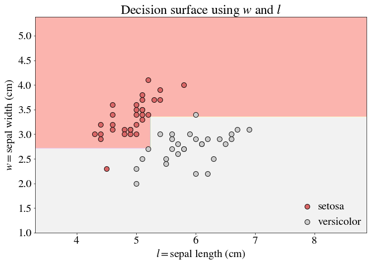

Tree-based methods are fantastic at finding nonlinear boundaries, particularly when used in ensemble or within boosting schemes. However, there's a lot to be learned about the humble lone decision tree that is generally overlooked (read: I overlooked these things when I first began my machine learning journey). In what follows I will briefly discuss how transformations of your data can vastly improve the ability of single trees to capture nonlinearities. If you are not yet familiar with decision trees, [Elements of Statistical Learning](https://web.stanford.edu/~hastie/ElemStatLearn/) has a wonderful overview.

## A simple case to wet your feet: transformations for classification

Let's begin with classification, where we often only need to make a few cuts to segment data. The boundaries of a decision tree by construction are perpendicular to its features. For example, a generic decision tree boundary may look something like this (using a simplified version of the [Iris Dataset](http://scikit-learn.org/stable/auto_examples/datasets/plot_iris_dataset.html)):

I've done a train-test-split here and am showing the performance on the test set. The color of the dots indicate the ground truth of the classification, and the background color indicates our prediction. But notice the tree is already a bit complicated for a boundary that seems so trivial!

In fact, there is a significantly simpler boundary line to draw, around $w \approx 1.2 l$. To obtain a decision boundary along this line, we need $w = 1.2 l$ to be a contour line of our transformation. Conveniently, $w-1.2l$ would produce such a contour line.

There is now just a single split along this transformed variable!

So there is power in transformations!

## Transformations for log-normality

Perhaps the above example was a bit too simple. But what if $l$ had been exponentiated to start? Often variables end up being log-normal, so this is not so far from reality! Let's take $exp(l)$ as our feature instead of $l$. If we made a simple tree using the log-normal feature as is, we'll find a boundary as follows:

Note that this boundary is actually the same as the boundary in our first figure, without the exponentiation! And that is to be expected -- the ordering of these variables with respect to these axes does not change with a logarithm. **So splits that are perpendicular to the axes, which only make divisions with respect to these orderings, do not change.** 

However, because the relationship between the variables is different, any transformation that related the two variables will produce a different boundary. For example, if we used a simple linear combination $w - 1.2 \exp(l)$ as before, the line is quite hard to draw. The exponentiation can obscure the formerly linear decision boundary.

As you might expect (perhaps it's a bit too trivial by construction), $w - 1.2 l$ is what we really want. Thus, simply taking the $\log$ of $exp(l)$ allows for a decision boundary that fits this space (if we changed the $x$ axis to $l$ instead of $\exp(l)$, we would have a straight line).

## Transformations for regression

Fundamentally, classification is quite simple -- we only need to determine the equation for the decision boundary, and we can  easily see that we need a transformation that holds the same value along this boundary (granted, this is much more difficult in higher dimensions!). For regression, the idea is a bit broader. We need a transformation that holds the same value along *any* boundary you might want to draw. We therefore need to define a surface whose contour lines parallel the **contour lines of the label**. To demonstrate how this works, we'll need a slightly more cumbersome, quantitative dataset on which to regress. 

If we try to predict the y-value with by using a decision tree regressor with features $x_1$ and $x_2$, we'll end up with decision boundaries like this:

... and a tree that is so horrendously complex that I cannot post it here. But note there's a symmetry in the data which we can explote. The decision boundaries appear to be concentric circles around $(x_1, x_2) = (0.5, 0.5)$ (in fact, that's exactly what they are, with some added noise). Let's therefore create a new feature $x = (x_1-0.5)^2 + (x_2-0.5)^2$ and use it as the only feature in our regression.

While it's a bit hard to visualize the accuracy on the test set here, take my word for it that the test error here is lower than it is before the transformation. Here, I'll give it a try anyway:

Not that it helps, but it's so pretty!

## Actually finding these boundaries in practice...

... is actually pretty impossible. But at least that was a fun journey, no?

In all seriousness, an open question is whether we can actually transform our data in a way that mirrors what we've done here. The first few examples of a linear, but rotated, boundary are actually close to what is done using orthogonal transformations such as [PCA](https://en.wikipedia.org/wiki/Principal_component_analysis), except that PCA rotates your feature space towards eigenvectors, not those that minimize entropy gained by splitting along the resulting axes, which is what we really want (they would fail in our first example to rotate correctly). And the logarithmic transform example illustrates why a logarithm may be necessary *before* attempting to apply any such orthogonal transform. But in any case, it seems a transformation like the circularly-symmetric one we used for the regression example must be generously rooted in intuition, for now. 

**What we need is a non-parametric method that finds these boundaries for you!** But until, then, it probably suffices to just accept absurd complexities in your models and use xgboost... 

... because what is a circle but a polygon with infinite sides?
